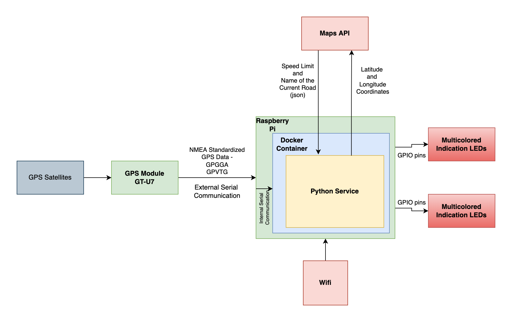

# live-speed-limit-indicator

## Explanation
Project uses raspberry pi and gps module to get current car speed and live speed limit for road and provides indication if speed limit is crossed.
1. Current speed is received from GPS module.
2. Current coordintes are received in HHMMMMMM format from GPS module and converted to degrees
3. Current speed limit of the road is received from Here Maps API using the degree coordinates
4. Speed limit in mph is normalized to base of 5 and compared with current car speed to control LEDs based on status
5. Status available - within speed limit, nearing speed limit, above speed limit, above speed limit+5

## Architecture diagram

## Equipment used
1. Raspberry Pi 3b
2. 16gb sandisk memory card - rasbian os
3. GPS Module - GT-U7

## Technologies used
1. Python, poetry, pip
2. Raspberry Pi - IoT(Internet of Things)
3. GPS technology
4. NMEA Standards for GPS telemetry
5. Serial communication interface
6. Docker
7. REST API
8. Linux and Raspbian OS
9. Git version control system

## How to run:
1. clone the repository
2. run - poetry install
3. run - poetry shell
4. cd live_speed_limit_sensor
5. python main.py

If required instructions on .env file - email me at 'tayade.amogh@gmail.com'

## To run docker image:
1. install docker
2. cd in the repository folder
3. docker build -t live-speed-limit-indicator .
4. docker run -it --device=/dev/ttyACM0 live-speed-limit-indicator